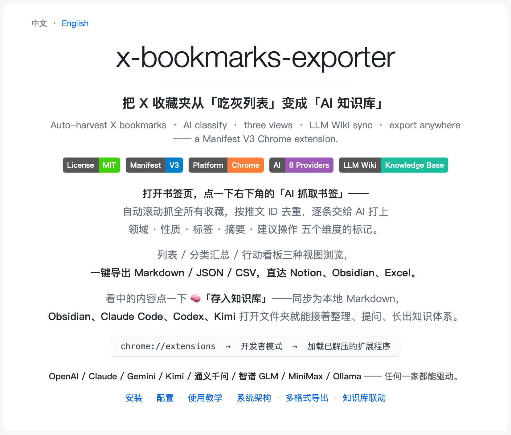
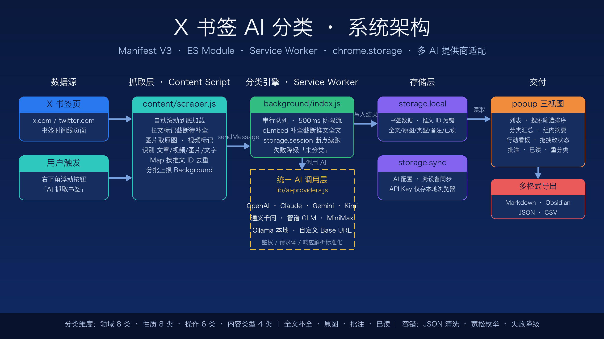

# X Bookmarks AI Classifier / X 书签 AI 分类



**English** | [中文](#功能)

A Chrome extension (Manifest V3) that automatically scrapes your X (Twitter) bookmarks, classifies them with AI, and lets you browse them in three views (List / Category Summary / Action Board) with multi-format export (Markdown / JSON / CSV).

一个 Chrome 扩展（Manifest V3）：自动抓取 X（Twitter）书签，用 AI 分类打标，支持列表 / 分类汇总 / 行动看板三种视图浏览，以及 Markdown / JSON / CSV 多格式导出。

---

## 🎥 Tutorial / 教学视频

**最新版演示（v2.3，含 LLM Wiki 知识库联动）：[docs/tutorial.mp4](docs/tutorial.mp4)**（点击在线播放，75 秒带中文旁白：分类 → 三视图 → 存知识库 → 桥接多目标 → Obsidian 入库效果）

旧版基础演示（抓取流程）：https://github.com/user-attachments/assets/c669b14b-ac60-40fe-8a3b-808941182870

---

## Features / 功能

**English:**

- **One-click bookmark scraping**: Open the X bookmarks page, click the "AI Scrape Bookmarks" floating button at the bottom-right, and it auto-scrolls to the end while scraping all tweets (deduplicated by ID).
- **Full content capture**: Long tweets are completed via oEmbed; images are captured at original (large) URL; videos are labeled with type and retain links + titles.
- **Content type detection**: Automatically distinguishes Article / Video / Image / Text with type badges on cards and filter support.
- **Multi-AI providers**: OpenAI, Claude, Gemini, Kimi (Moonshot), Tongyi Qianwen, Zhipu GLM, MiniMax, and local Ollama; supports custom Base URL (proxy or OpenAI-compatible services).
- **AI five-dimension classification**: category, nature, tags, summary, action; loose enum matching with automatic fallback to "Uncategorized" on API failure — never blocks the queue.
- **Three views**: List (search/filter/sort), Category Summary (grouped by dimension + AI-generated group summaries), Action Board (six-column Kanban with drag-and-drop status changes).
- **Notes & Read status**: Write notes on each bookmark (exported as callouts), mark read/unread with filtering, and auto-mark as read when clicking "Original".
- **Multi-format export**: Export visible content filtered by current search as Markdown / Obsidian (YAML frontmatter + tags + callouts + embedded images) / JSON / CSV.
- **Data management**: Delete single items, re-classify (re-run with new AI), and clear all (with confirmation).
- **LLM Wiki deep mode (optional)**: Point the options page at a local LLM Wiki server (default `http://127.0.0.1:19828`) to sync deep content into a knowledge base. Three routing strategies — manual (push by hand), smart (AI-flagged deep content awaits your ⏳ confirmation), auto (deep content pushed automatically); deep content is detected by content nature or a configurable text-length threshold. Dragging a card into configured Kanban columns (e.g. Research / Citable) triggers sync automatically; cards show 🧠 synced / ⏳ pending / ⚠ failed badges, and batch selection + push is supported (serial with progress, queue persists across restarts). Disabled by default — the extension works fully in lightweight mode without it.
- **Zero-config bridge**: the AI Key is entered once in the options page and auto-synced to the local bridge — no duplicate setup. Every push also auto-maintains `index.md` (content index) and `log.md` (timeline) in each target folder, following the [Karpathy LLM Wiki](https://gist.github.com/karpathy/442a6bf555914893e9891c11519de94f) pattern, so Claude Code / Codex / Kimi can navigate the knowledge base on their own when you open the folder.

**中文：**

- **一键抓取书签**：打开 X 书签页（新版为「历史 > 书签」），点击右下角「AI 抓取书签」浮动按钮，自动滚动到底部并抓取全部推文（ID 去重）。
- **完整内容抓取**：长推文自动通过 oEmbed 补全全文；图片抓取原图（large 尺寸）URL；视频标注类型并保留链接与标题。
- **内容类型识别**：自动区分 文章 / 视频 / 图片 / 文字 四种内容类型，卡片显示类型徽章，可按类型筛选。
- **多 AI 提供商**：OpenAI、Claude、Gemini、Kimi（月之暗面）、通义千问、智谱 GLM、MiniMax、Ollama 本地；支持自定义 Base URL（代理或 OpenAI 兼容服务）。
- **AI 五维分类**：category（领域）、nature（性质）、tags（标签）、summary（摘要）、action（建议操作）；枚举值宽松匹配容错，API 失败自动降级为「未分类」，不阻塞队列。
- **三种视图**：列表（搜索/筛选/排序）、分类汇总（按维度分组聚合 + 组内 AI 摘要）、行动看板（六栏拖拽变更状态）。
- **批注与已读**：每条书签可写备注（callout 导出）、可标记已读/未读并筛选，点「原文」自动标记已读。
- **多格式导出**：按当前搜索筛选条件导出可见内容为 Markdown / Obsidian（YAML frontmatter + 标签 + callout + 图片内嵌）/ JSON / CSV。
- **数据管理**：单条删除、重分类（换 AI 后一键重跑）、清空全部（二次确认）。
- **LLM Wiki 深度模式（可选）**：在设置页配置本地 LLM Wiki 服务（默认 `http://127.0.0.1:19828`）后，可将深度内容同步到知识库。支持 manual / smart / auto 三种分流策略：深度判定（按内容性质或正文长度阈值）后分别走手动推送、⏳ 待确认、自动推送；看板拖入「待研究 / 可引用」等指定列自动触发同步；列表卡片显示 🧠 已同步 / ⏳ 待确认 / ⚠ 同步失败角标，支持批量选择推送（串行 + 进度提示，队列持久化可断点续跑）。不启用时扩展保持纯轻量模式，不影响原有功能。
- **零配置桥接**：AI Key 只需在扩展设置页填一次，会自动同步给本地桥接服务，无需重复配置。每次推送还会在各目标文件夹自动维护 `index.md`（内容索引）和 `log.md`（时间线日志），遵循 [Karpathy LLM Wiki](https://gist.github.com/karpathy/442a6bf555914893e9891c11519de94f) 范式——用 Claude Code / Codex / Kimi 打开文件夹时，AI 可以自己按索引浏览整个知识库。

---

## Getting Started / 使用教学

### Step 1 / 第 1 步：Install the Extension / 安装扩展

**English:**
1. Download this repository (`Code → Download ZIP` and extract, or `git clone`).
2. Enter `chrome://extensions` in your browser address bar and press Enter.
3. Turn on the **Developer mode** switch in the top-right corner.
4. Click **Load unpacked** in the top-left and select this project folder.
5. After installation, the settings page opens automatically. We recommend clicking the puzzle icon in the toolbar and **pinning** this extension for easy access.

> No dependencies to install, no build step required — pure vanilla JavaScript.

**中文：**
1. 下载本仓库代码（`Code → Download ZIP` 后解压，或 `git clone`）。
2. 浏览器地址栏输入 `chrome://extensions` 并回车。
3. 打开页面右上角的「开发者模式」开关。
4. 点击左上角「加载已解压的扩展程序」，选择本项目文件夹。
5. 安装成功后会自动打开设置页；建议点击工具栏拼图图标，把本扩展**固定（Pin）**到工具栏方便使用。

> 无需安装任何依赖、无需构建，纯原生 JavaScript。

---

### Step 2 / 第 2 步：Configure AI Provider / 配置 AI 提供商

**English:**
The classification feature relies on an AI API. In the settings page (opens automatically after install, or click ⚙ in the popup):

1. **Select an AI provider** from the dropdown, then fill in the corresponding **API Key**:

   | Provider | API Key URL | Notes |
   |----------|-------------|-------|
   | OpenAI | platform.openai.com → API keys | |
   | Claude | console.anthropic.com | |
   | Gemini | aistudio.google.com → Get API key | Free tier available |
   | Kimi (Moonshot) | platform.moonshot.cn | |
   | Tongyi Qianwen | bailian.console.aliyun.com | Alibaba Cloud |
   | Zhipu GLM | open.bigmodel.cn | |
   | MiniMax | platform.minimaxi.com | |
   | Ollama (Local) | No key needed | Run `ollama serve` locally with a model pulled |

2. **(Optional) Select a model**: The dropdown lists recommended models for the provider; defaults are fine.
3. **(Optional) Custom Base URL**: Fill this when using a proxy or an OpenAI-compatible third-party service; leave blank for official default. The browser will ask for permission to access that domain — click **Allow**.
4. Click **Test Connection**: Green ✓ means the config works; Red ✗ means check your Key, network, and Base URL.
5. Click **Save**. Config is stored in `chrome.storage.sync` and auto-syncs across devices signed into the same Google account.

**中文：**
分类功能依赖一个 AI 接口。在设置页（安装后自动打开，或点 popup 右上角 ⚙ 进入）：

1. **选择 AI 提供商**（下拉框），然后填写对应的 **API Key**：

   | 提供商 | API Key 获取地址 | 备注 |
   |--------|------------------|------|
   | OpenAI | platform.openai.com → API keys | |
   | Claude | console.anthropic.com | |
   | Gemini | aistudio.google.com → Get API key | 有免费额度 |
   | Kimi（月之暗面） | platform.moonshot.cn | |
   | 通义千问 | bailian.console.aliyun.com | 阿里云百炼 |
   | 智谱 GLM | open.bigmodel.cn | |
   | MiniMax | platform.minimaxi.com | |
   | Ollama（本地） | 无需 Key | 需本机运行 `ollama serve` 并已拉取模型 |

2. **（可选）选择模型**：下拉框会列出该提供商的推荐模型，默认即可。
3. **（可选）自定义 Base URL**：走代理或使用 OpenAI 兼容的第三方服务时填写；留空用官方默认地址。填写后浏览器会弹窗请求该域名的访问权限，点「允许」。
4. 点击「**测试连接**」：显示绿色 ✓ 表示配置可用；红色 ✗ 请检查 Key、网络和 Base URL。
5. 点击「**保存**」。配置会存入 `chrome.storage.sync`，同一 Google 账号的多台设备自动同步。

---

### Step 3 / 第 3 步：Scrape Bookmarks / 抓取书签

**English:**
1. Log in to X and open the bookmarks page: `x.com/i/bookmarks` (twitter.com is also supported).
2. A floating button **"AI Scrape Bookmarks"** appears at the **bottom-right** of the page — click it.
3. The extension starts auto-scrolling, extracting tweets (ID, text, author, time, links) and deduplicating as it goes.
4. It stops automatically when no more content is found, showing a notification with the count.
5. Scraped tweets enter a background classification queue, processed one by one with 0.5s intervals to avoid rate limits.

> Scraping many bookmarks takes time — do not close the tab. Repeated clicks won't create duplicates (deduplicated by tweet ID).

**中文：**
1. 登录 X，打开书签页：`x.com/i/bookmarks`（twitter.com 域名同样支持）。
2. 页面**右下角**会出现「**AI 抓取书签**」浮动按钮，点击它。
3. 扩展开始自动向下滚动页面，边滚动边提取推文（推文 ID、正文、作者、时间、链接），并自动去重。
4. 滚动到没有更多内容后自动停止，弹出提示显示本次共抓取多少条。
5. 抓取到的推文会自动进入后台分类队列，逐条调用 AI 分类（每条间隔 0.5 秒防限流）。

> 书签很多时滚动抓取需要一些时间，期间请勿关闭该标签页。重复点击按钮不会产生重复数据（按推文 ID 去重）。

---

### Step 4 / 第 4 步：Browse & Manage (Popup) / 浏览与管理

**English:**
Click the extension icon in the toolbar to open the library.

**Top Toolbar**
- 🔍 **Search box**: Real-time matching across text, author, tags, and summary.
- **Three filter dropdowns**: Filter by category / nature / suggested action.
- **Sort**: Newest first / Oldest first / By category / By author.
- **Progress bar** appears during classification (e.g., "Classifying 12/50"), with newly classified bookmarks inserted in real time.

**Three Views (Tab Switch)**

| View | Description |
|------|-------------|
| **List** | Card stream: author, date, colored nature badge, one-line summary, tags, category. Click link to open the original tweet. |
| **Category Summary** | Grouped and collapsible by dimension (category / nature / action), showing counts per group; click "Generate group summary" to aggregate tweets in the same group into a summary card. |
| **Action Board** | Six columns by suggested action (Read Later / Research / Citable / Try / Share / Archived). **Drag cards** to change status. |

Nature badge colors: 🟢 Tool/Resource · 🔵 Tutorial/Guide · 🟠 Opinion/Commentary · 🔴 News/Update · 🟣 Deep Thread · 🩵 Inspiration · 🟡 Actionable · ⚪ Archive

**中文：**
点击工具栏的扩展图标打开收藏界面：

**顶部工具栏**
- 🔍 **搜索框**：输入关键词实时匹配正文、作者、标签、摘要。
- **三个筛选下拉**：按领域 / 性质 / 建议操作过滤。
- **排序**：最新优先 / 最早优先 / 按领域 / 按作者。
- **分类中**时会显示进度条（如「正在分类 12/50」），新分类完成的书签会实时插入列表。

**三种视图（Tab 切换）**

| 视图 | 说明 |
|------|------|
| **列表** | 卡片流：作者、日期、彩色性质徽章、一句话摘要、标签、领域，点击链接跳回原推文 |
| **分类汇总** | 按维度（领域/性质/操作）分组折叠展示，每组显示数量；点击「生成组内摘要」可把同组推文聚合成一张汇总卡片 |
| **行动看板** | 按建议操作分六栏（稍后阅读/待研究/可引用/可试用/可分享/已归档），**拖拽卡片**即可变更状态 |

性质徽章配色：🟢 工具资源 · 🔵 教程指南 · 🟠 观点评论 · 🔴 新闻快讯 · 🟣 深度线程 · 🩵 灵感创意 · 🟡 待办行动 · ⚪ 归档资料

---

### Step 5 / 第 5 步：Export / 导出

**English:**
In the popup header, click **Markdown / JSON / CSV** to download directly:

- **Only exports currently visible content** — use search/filters to narrow down first, then export to achieve needs like "export only AI/tech bookmarks."
- **Markdown**: Grouped by category with H2 headings; each item includes summary, author, date, tags, and link. Great for importing into Notion / Obsidian.
- **JSON**: Full field array for backup or further development.
- **CSV**: Opens directly in Excel (with UTF-8 BOM to prevent Chinese garbled text); tags are semicolon-separated.

**中文：**
在 popup 顶部点击 **Markdown / JSON / CSV** 按钮，浏览器会直接下载文件：

- **只导出当前可见内容**——先用搜索/筛选缩小范围，再点导出，即可实现「只导出 AI/技术类」这类按需导出。
- **Markdown**：按领域分组的二级标题结构，每条含摘要、作者、日期、标签、链接，适合导入 Notion / Obsidian。
- **JSON**：完整字段数组，适合备份或二次开发。
- **CSV**：Excel 可直接打开（带 UTF-8 BOM 防中文乱码），标签用分号分隔。

---

## FAQ / 常见问题

**Q: I clicked the scrape button but nothing happened? / 点了抓取按钮没反应？**
- **EN:** Make sure you're on `x.com/i/bookmarks` and logged in. Refresh the page to re-inject the content script. If still not working, check `chrome://extensions` for errors.
- **中文：** 先确认当前在 `x.com/i/bookmarks` 页面且已登录；刷新页面让 content script 重新注入；仍无效请到 `chrome://extensions` 看扩展是否报错。

**Q: Everything shows "Uncategorized"? / 分类全部显示「未分类」？**
- **EN:** The AI call is failing. Open settings and click "Test Connection" to troubleshoot: check API Key correctness, account balance, and whether the custom Base URL is reachable.
- **中文：** 说明 AI 调用失败。打开设置页点「测试连接」排查：API Key 是否正确、账户是否有余额、自定义 Base URL 是否可达。

**Q: The browser stopped the extension mid-way? / 抓取到一半浏览器把后台停了？**
- **EN:** The classification queue is persisted; the extension auto-resumes when reactivated. For large batches, keep the browser running.
- **中文：** 分类队列已持久化，扩展被唤醒后会自动续跑；但大批量分类时建议保持浏览器运行。

**Q: Fewer bookmarks scraped than expected? / 抓取数量比实际书签少？**
- **EN:** X occasionally updates its page structure. If you notice significant missed tweets, the DOM selectors may need updating in `content/scraper.js` — feel free to open an Issue.
- **中文：** X 的页面结构偶尔改版。如果明显漏抓，是 DOM 选择器失效，需要更新 `content/scraper.js`，欢迎提 Issue。

**Q: Where is data stored? Is it uploaded anywhere? / 数据存在哪里？会上传吗？**
- **EN:** Bookmark data is stored locally in `chrome.storage.local`. Only tweet text is sent to the **AI provider you configured**; the extension does not pass through any third-party servers.
- **中文：** 书签数据存在本地 `chrome.storage.local`；只有推文文本会发送给**你自己配置**的 AI 服务商，扩展不经过任何第三方服务器。

---

## Architecture / 架构



```
x-bookmark-ai/
├── manifest.json            MV3 manifest (popup + module SW + content script)
├── background/
│   └── index.js             Service Worker: classification queue (storage.session persistence,
│                              resumable), message routing, export downloads, data migration
├── content/
│   └── scraper.js           Bookmark page scraper: floating button, auto-scroll, DOM extraction,
│                              Map deduplication (self-contained classic script)
├── popup/
│   ├── popup.html/css/js    Library UI: search/filter/sort + List/Summary/Board three views + live progress
├── options/
│   ├── options.html/js      Settings page: provider selection, API Key, model, custom Base URL,
│                              test connection, LLM Wiki config (routing strategy, sink selection)
├── bridge/
│   ├── wiki-bridge.mjs      Local Wiki bridge service (optional): receives pushed bookmarks via
│                              HTTP, writes one Markdown file per entry into any note app's folder
│                              (Obsidian vault / Logseq graph / plain md dir), optional auto-ingest
│                              via karpathywiki-cli into a linked wiki; multi-sink, selectable
│   └── config.example.json  Bridge config template (sinks + LLM for ingest; real config.json is gitignored)
└── lib/
    ├── constants.js         Classification dimension enums & defaults (incl. LLM Wiki defaults)
    ├── ai-providers.js      8 AI provider adapters (auth/request body/response parsing standardized)
    ├── wiki-api.js          Wiki bridge client (health/sinks/push, 429 backoff) + deep-content routing
    ├── prompt.js            Unified classification prompt + JSON fault-tolerant parsing
    ├── export.js            Markdown / JSON / CSV generation
    └── storage.js           chrome.storage wrapper (single-key storage + legacy data migration)
```

### Wiki Bridge / Wiki 桥（可选）

**English:**
The extension pushes deep bookmarks to a local bridge service (`node bridge/wiki-bridge.mjs`, default `http://127.0.0.1:19828`). The bridge writes one Markdown file per entry into the folder of your note app — Obsidian vault, Logseq graph, or any plain Markdown directory — so the same content works across note apps. Copy `bridge/config.example.json` to `bridge/config.json` to configure sinks, or add them from the bridge's web UI (`http://127.0.0.1:19828`, "添加笔记库" form) without editing JSON; pick the target sink in the extension's options page (fetched live from the bridge). With `autoIngest: true` and an LLM configured (any OpenAI-compatible endpoint: MiniMax / OpenAI / Kimi / local Ollama), the bridge does built-in entity extraction — no external CLI needed — writing interlinked concept pages (`[[wikilinks]]`) into each sink's `wikiDir`, ready for graph view and chat plugins such as the [Karpathy LLM Wiki Obsidian plugin](https://community.obsidian.md/plugins/karpathywiki). To auto-start the bridge on macOS login, install it as a launchd agent (`~/Library/LaunchAgents/com.xbe.wiki-bridge.plist`, `RunAtLoad` + `KeepAlive`). Sinks can also point at AI CLI workspace folders (e.g. Claude Code, Codex, Kimi): each pushed bookmark becomes a Markdown file the agent can read when you open it there. In the popup's batch mode, a target dropdown lets you pick which sink the selected bookmarks go to; the same bookmark can be distributed to multiple sinks (dedupe is per bookmark × sink). After every push the bridge rebuilds `index.md` (concept + source index) and appends to `log.md` (timeline) in each sink, so AI agents can navigate the knowledge base Karpathy-style. The AI config is entered once in the extension's options page and pushed to the bridge automatically (`POST /api/llm`) when the bridge reports no LLM configured. Sink folders are recreated automatically if deleted while the bridge is running.

**中文：**
扩展把深度书签推送到本地桥接服务（`node bridge/wiki-bridge.mjs`，默认 `http://127.0.0.1:19828`）。桥接把每条内容写成一个 Markdown 文件到你的笔记目录——Obsidian 仓库、Logseq graph 或任意 md 文件夹——同一份内容跨笔记软件通用。复制 `bridge/config.example.json` 为 `bridge/config.json` 配置 sink，或直接在桥接网页界面（`http://127.0.0.1:19828` 的「添加笔记库」表单）添加，无需手改 JSON；在扩展设置页选择推送目标（实时从桥接拉取）。开启 `autoIngest` 并配置 LLM（任意 OpenAI 兼容接口：MiniMax / OpenAI / Kimi / 本地 Ollama 均可）后，桥接会做内置实体抽取——无需安装任何外部 CLI——把双链概念页（`[[wikilinks]]`）写进各 sink 的 `wikiDir`，可直接配合 [Karpathy LLM Wiki Obsidian 插件](https://community.obsidian.md/plugins/karpathywiki) 做图谱浏览和对话问答。macOS 下可把桥接装成 launchd  agent（`~/Library/LaunchAgents/com.xbe.wiki-bridge.plist`，`RunAtLoad` + `KeepAlive`）实现开机自启。sink 也可以指向 AI CLI 的工作文件夹（如 Claude Code、Codex、Kimi）：推送的书签会成为该文件夹里的 Markdown 文件，打开对应工具即可读取整理。popup 批量模式下有目标下拉框，可选择这批书签推到哪个 sink；同一条书签可分发到多个 sink（按 书签 × sink 去重）。每次推送后桥接会自动重建 `index.md`（概念页 + 源书签索引）并向 `log.md` 追加时间线日志，AI 工具可按 Karpathy 范式自行浏览知识库。AI 配置只需在扩展设置页填一次，桥接报告未配置 LLM 时扩展会自动下发（`POST /api/llm`）。sink 目录在桥接运行期间被删除也会自动重建。

---

## Data & Privacy / 数据与隐私

**English:**
- Bookmarks are stored in `chrome.storage.local` (single-key storage by tweet ID); AI configuration is stored in `chrome.storage.sync` (synced across your Google account).
- Only tweet text is sent to the AI API you configured; your API Key connects directly to the provider's domain.

**中文：**
- 书签存 `chrome.storage.local`（推文 ID 为键单条存储）；AI 配置存 `chrome.storage.sync`（随账号同步）。
- 仅推文文本会发送给你配置的 AI API，API Key 只直连对应服务商域名。

---

## Known Limitations / 已知限制

**English:**
- X's DOM structure (`data-testid="tweet"`, etc.) may break when X updates its UI, requiring an update to `content/scraper.js`.
- The Service Worker may be terminated when idle: the classification queue is persisted to `chrome.storage.session` and resumes on wake, but for large batches keep the browser running.
- Data URI exports may hit Chrome download limits with extremely large datasets (tens of thousands of items).

**中文：**
- X 的 DOM 结构（`data-testid="tweet"` 等选择器）可能随官方改版失效，届时需更新 `content/scraper.js`。
- Service Worker 空闲会被终止：分类队列已持久化到 `chrome.storage.session`，唤醒后继续；但大批量分类请保持浏览器运行。
- data URI 导出在数据量极大（数万条）时可能受 Chrome 下载限制。

---

## License / 许可

MIT
